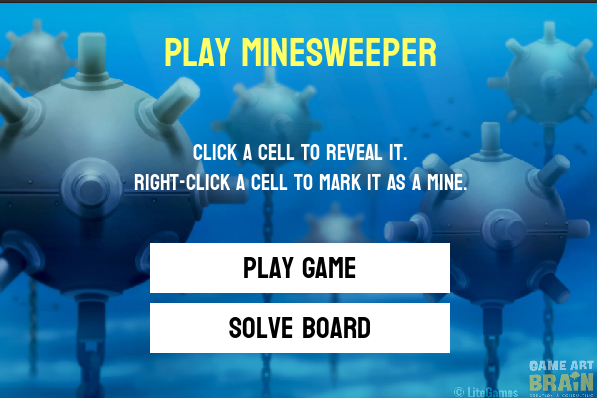
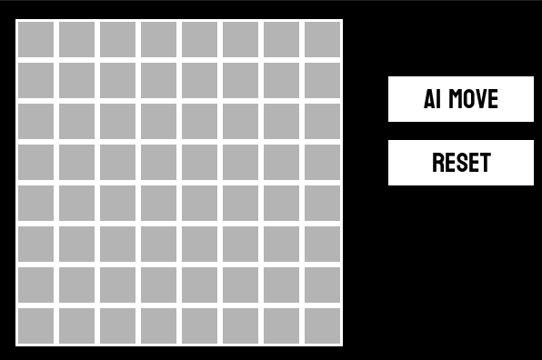
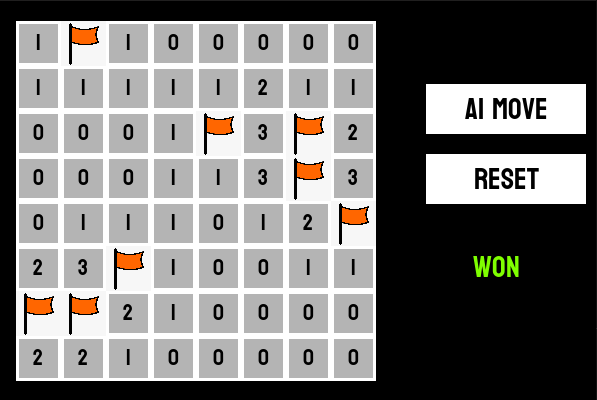
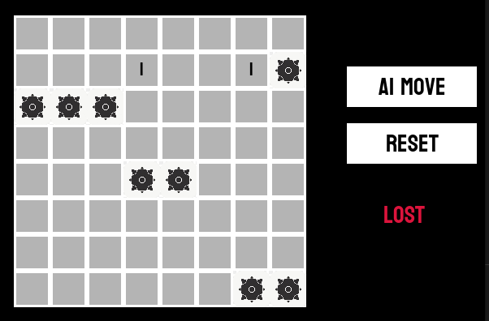
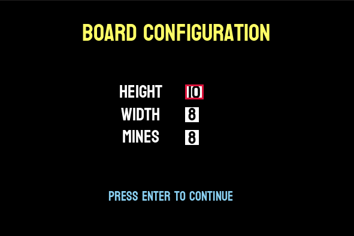
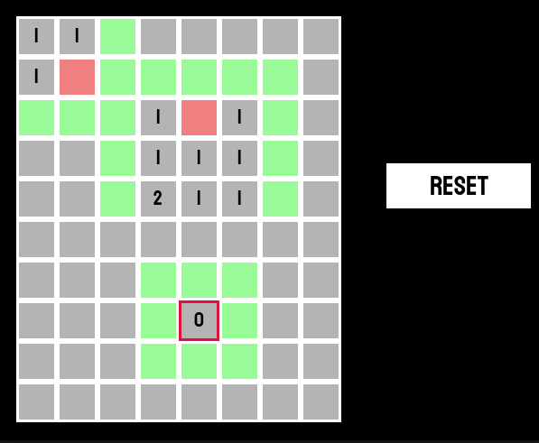

# Minesweeper Ai
***Solve any minesweeper board***

#
#### The program has both a mode to solve a board of any ratio/ no. of mines and a mode to let you play and offer a move if you get stuck

### **Main screen**


## Requirements :

- [Python 3](https://www.python.org/downloads/)

- [Pygame](https://www.pygame.org/download.shtml) which can be easily installed after installing python with the command -

```
pip3 install pygame
```
or in case that doesn't work
```
python3 -m pip3 install pygame
```

#### To run the program simply download all the files from the resporitory or clone them and then run runner.py using python

### **Screenshots**





